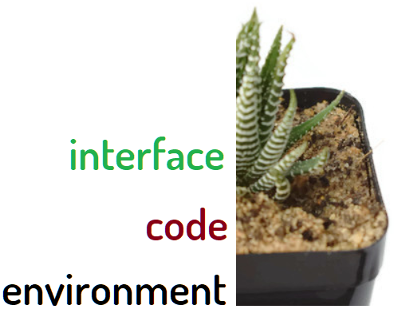

+ [polish version - PL](https://docs.modware.org/README_PL.html)

## keywords

+ patterns
+ rules
+ technology
+ standards
+ software
+ definitions
+ requierements

# What [**MODWARE**](https://docs.modware.org) is?


**MODWARE** provides solutions for building applications and services in any environment.
The Foundation API based on shell scripts that allow you to retrieve, manage and publish Your data to various display services, run geoprocessing models, and more.
Our workflow in SOftware Development is clear:

    Modularisation -> Standardisation -> Automation

it's a Continuous Improvement, never end development.


## Why **MODWARE**?

**MODWARE** Service has been developed as a best practice to integration capability of software, to give end customers the best product and service!

+ What are You doing for Yours environment?

Bring your creative vision to life with MODWARE tools.


### Alternative way

May be You are using in Your organisation many different solution, may be one cloud based.

How old are these technologies, what can be after 10 years?

If You are creating serious software for long term, the perspective is very important.

That's why **MODWARE** is not creating new tool, just using the old school tools in beauty way, because  
the quality is for us very important and we expect long-term solution, which is not just popular solution for today!

If You are looking for long term solutions the standards are clear, what you can just make better are standards of usage it, such testing

For us is clear that we need solution for whole our (not just application) life.  
It can take next 50 years for support **MODWARE** solutions.

We know it and we are ready for it!

+ How will change the technology?
+ How will change the people and world?


Nobody knows, so the best what we can do now is to prepare the ecosystem with understandable and tested solutions for decades.

The roles are clear:

#### Simplicity

+ [KISS-Prinzip – Keep it simple *](https://de.wikipedia.org/wiki/KISS-Prinzip)

+ Keep it simple, stupid
+ Keep it simple and short
+ Keep it simple and smart
+ Keep it simple and straightforward

The KISS principle states that most systems work best if they are kept simple rather than made complicated;  
therefore, simplicity should be a key goal in design, and unnecessary complexity should be avoided.  
The phrase has been associated with aircraft engineer Kelly Johnson.  
The term "KISS principle" was in popular use by 1970.  
Variations on the phrase include:  
 "Keep it simple, silly", "keep it short and simple", "keep it simple and straightforward", "keep it small and simple", or "keep it stupid simple".


#### Transparent (for everyone)

+ Create readable & testable code of your environment through standards
+ The term transparent is widely used in computing marketing in substitution of the term invisible, since the term invisible has a bad connotation (usually seen as something that the user can't see and has no control over) while the term transparent has a good connotation (usually associated with not hiding anything)

#### Opened (for The Future)

+ Use opened solutions, which are free and opensource for long term with support & community
+ Open-source code is meant to be a collaborative effort, where programmers improve upon the source code and share the changes within the community.
+ Free and open-source software (FOSS) or Free/libre and open-source software (FLOSS) is openly shared source code that is
licensed without any restrictions on usage, modification, or distribution.
Confusion persists about this completely unrestricted definition because the "Free", also known as "Libre",
refers to the freedom or the product not the price, expense, cost, or charge.

## Benefits

+ low entry threshold for learning / understanding these standards
+ such many opensource projects, we share open ideas with wide spectrum of usage
+ our goals are on technical sides, the rule is: better high technical level than high level of monetizing
+ that the reason, why we don't care about fast earaning money, but fast creating usage solutions on wide spectrum.


### native interface, code, environment


Why do we think our solution is the best?
Because we never create plastic entities, pseudo-languages.
We base projects with standard standards, MODWARE provides them in a modularized form.


## What we offer You?

We Love Software Development and we create the best solutions with pleasure!
We are able to create the best solutions, because we have deep understanding of technology based on advanced projects.
We are earning money on trainings for teams which are opened to increase quality of software development at any time.
We are independent and free to create the best IT solutions on the World!

+ [EDUCATION.md](EDUCATION.md)

### Example of wide spectrum on technical side

if You need solve technical problem based on Python/Java/NodeJS, many solutions are based on one language.
In MODWARE case we are supporting and providing for each language the same SDK solution, which  
avaliable to use in your application programming language.

Who give you the opportunity to use your own technical solutions in external libraries?
We're opened and we're giving You opensource code which is ready to set and go!

---


    No license, no subscriptions, ready to use!


## How we understand an API

An application programming interface (API) is a computing interface which defines interactions between multiple software intermediaries. It defines the kinds of calls or requests that can be made, how to make them, the data formats that should be used, the conventions to follow

API (od ang. application programming interface)

Today, with the rise of REST and web services over HTTP, the term is often assumed to refer to APIs of such services when given no other context (see the Web APIs section).

The term API is, by extension, used to refer to the subset of software entities (code, subcomponents, modules, etc.) that serve to actually implement the API of some encompassing component or system.

## About API logo

A + (number) PI = API


---

## modular foundation

Let's explore its key aspects: **Design**, **Standards**, **Principles**, and the foundational elements that support it:

### Design for Modular Construction
Modular construction involves prefabricating building components off-site and then assembling them at the project location. It integrates design, manufacturing, and construction processes while maintaining aesthetic intent.
The **American Institute of Architects (AIA)** provides a comprehensive guide titled "Design for Modular Construction: An Introduction for Architects." This guide explains the benefits, challenges, and best practices of modular design and construction¹. You can download the PDF to learn how to apply modular techniques to your projects.

### Standards for Efficient Modular Construction
Standards play a crucial role in ensuring effective, efficient, and resilient modular construction. They provide guidance, best practices, and requirements.


### Modular Principles
Modular design principles guide the creation of modular systems. Key principles include separation, unification, connection, and adaptation.
   

### Modular Foundation
The modular foundation encompasses all the above aspects—design, standards, and principles. It forms the essential groundwork for successful modular projects.
While specific sources directly addressing "modular foundation" may be limited, understanding the interplay of design, standards, and principles is crucial for building a robust modular framework:  [www.moduletool.com](https://www.moduletool.com/)


### Sources

(1) DESIGN FOR MODULAR CONSTRUCTION - AIA. https://content.aia.org/sites/default/files/2019-03/Materials_Practice_Guide_Modular_Construction.pdf.
(2) Standards for more efficient modular construction projects. https://www.csagroup.org/standards/areas-of-focus/construction-infrastructure/standards-for-more-efficient-modular-construction-projects/.
(3) M DESIGN GUIDELINE FOR PROJECTS FROM SCRATCH - DAAAM. https://www.daaam.info/Downloads/Pdfs/proceedings/proceedings_2018/120.pdf.
(4) What foundations do you need for a modular home? - Lumo Houses. https://lumohouses.com/learn/what-foundations-do-you-need-for-a-modular-home/.


---


## **MODWARE** solutions


### Modware - Modular Foundation

Modware is about building or providing the essential base upon which modular systems, designs, and standards can develop and thrive. It implies both a conceptual and practical grounding in everything related to modularity.
holistic approach to modularity, covering everything from basic principles and design to standards and applications.
Modware plays a pivotal role in educating and guiding the industry toward a solid understanding and adoption of modular techniques.
We support for future growth and innovation, emphasizing that new developments in modularity are grounded in solid, well-established practices.\

- **Modular Design** focuses specifically on the application of modularity in creating designs.
- **Modular Standards** is about setting and promoting rules for interoperability and consistency within modular systems.
- **Modular Principles** outlines the core beliefs and guidelines that underpin the modular approach.
- **Modular Foundation** encompasses all of the above by suggesting that Modware is working on the essential groundwork that supports principles, standards, and design in the modular world.

### Solutions

- Positions Modware as the foundational bedrock in the modular technology ecosystem.
- Implies robustness, stability, and reliability in the field of modular design and standardization.
- for a broad audience, including educators, developers, manufacturers, and businesses seeking a strong starting point in their journey towards modularity.
  


### Modware - Modular Principles

**Focus This emphasizes the fundamental guidelines and philosophies that drive modular design and development. It suggests that Modware is devoted to the core ideas and values that make up the concept of modularity in technology.

**Implications
- Positions Modware as a thought leader and educational resource in the realm of modularity.
- Suggests a commitment to the broader concepts of modularity, including flexibility, scalability, and efficiency.
- It could appeal to a wide audience—from educators and students to designers, engineers, and companies—interested in understanding and applying modular design principles.

### Strategic Considerations

- **Vision and Mission If Modware aims to educate, inspire, and guide the technology community about the virtues of modularity, "Modular Principles" could be more aligned with its goals.
- **Community and Collaboration This tagline also implies an openness to collaboration and discussion about what modularity means and how it can evolve, potentially fostering a community around these ideas.
- **Innovation vs. Standardization Unlike "Modular Standards," which leans towards conformity and interoperability, "Modular Principles" allows for a broader interpretation that can include innovation within the conceptual framework of modularity.


### Modware - Modular Design

**Focus This tagline emphasizes the concept and principles of modular design itself. It suggests that Modware is directly involved in the design aspect, advocating for or perhaps even pioneering designs that are modular in nature.

**Implications
- It positions Modware as an authority or leader in modular design practices.
- The emphasis is more on the creative and innovative aspects of modular systems.
- It might appeal more broadly to designers, engineers, and companies interested in adopting modular design principles in their work.

### Modware - Modular Standards

**Focus This tagline places emphasis on establishing, promoting, or adhering to modular standards. It indicates that Modware's primary role is to define and possibly enforce guidelines that ensure modular compatibility and interoperability.

**Implications
- It presents Modware as a regulatory body or a standard-setting organization.
- The focus is on consistency, quality, and compatibility across different modular products and systems.
- It might attract companies, developers, and engineers who are looking to align their products or designs with industry-standard modular principles for better interoperability and scalability.


## MODWARE PL

Modularyzacja jest ważnym aspektem w dzisiejszym świecie technologii i może przynieść wiele korzyści w projektowaniu i utrzymaniu systemów.

1. **Modular Design (Projektowanie Modułowe)
   - **Modularny design** to podejście projektowe, które skupia się na tworzeniu systemów lub produktów za pomocą **modułów**. Każdy moduł jest samodzielny i może być łatwo wymieniany lub modyfikowany bez wpływu na inne części systemu.
   - Przykład: Projektowanie samochodu z oddzielnymi modułami dla silnika, układu elektrycznego, wnętrza, itp.

2. **Modular Standards
   - **Modularne standardy** to zbiór zasad i wytycznych, które mają na celu zapewnienie spójności i interoperacyjności między różnymi modułami w systemie.
   - Przykład: Standardy komunikacji między różnymi komponentami oprogramowania w architekturze mikroserwisów.

3. **Modular Principles
   - **Modularne zasady** to fundamentalne przekonania i wytyczne, które kierują projektowaniem i implementacją modułów.
   - Przykład: Zasada "jednej odpowiedzialności" mówiąca, że każdy moduł powinien mieć jedno konkretne zadanie.

4. **Modular Foundation
   - **Modularna podstawa** to kompleksowe podejście, które łączy wszystkie aspekty modułowego świata: design, standardy i zasady.
   - Przykład: Organizacja Modware pracuje nad tworzeniem fundamentów, które wspierają rozwój modułowych systemów.


### [APIbuild](https://www.apibuild.com)


https://github.com/api-build

procesy określające kolejności powstawania nowych wersji oprogramowania, pozwala na odróżnienie wersji między sobą.

Zazwyczaj jest liczbą naturalną (np. numerowanie wersji od 1 lub według roku powstania), liczbą rzeczywistą lub zestawieniem kilku liczb naturalnych. W ostatnim przypadku kolejne liczby oddziela się zazwyczaj kropką, a ich znaczenie jest następujące:
+ Major (numer główny),
+ Minor (numer dodatkowy),
+ Release (numer wydania)

Responsibility:
+ #MANAGER-ROLE


### [APIunit](https://www.apiunit.com)


https://github.com/apiunit

definition of application for generating project on environment with source code

Responsibility:
+ #MANAGER-ROLE
+ #ADMIN-ROLE
+ #DEV-ROLE


### [APIfunc](https://www.apifunc.com)


https://github.com/apifunc

The environment for code execution of one simple function for any programming language from the list:
+ javascript / nodeJS
+ python
+ php


Responsibility:
+ #DEV-ROLE


### [APIsql](https://www.apisql.com)


https://github.com/apisql

Data integration for models statements

Responsibility:
+ #DEV-ROLE


### [APIcra](https://www.apicra.com)


https://github.com/apicra

library of shell scripts

Responsibility:
+ #DEV-ROLE


### [APIexec](https://www.apiexec.com)


https://github.com/apiexec

runner for APIcra scripts

Responsibility:
+ #DEV-ROLE


---

# The projects are using **MODWARE** solutions

## [DevOpsTerminal](https://docs.devopsterminal.com/)


https://github.com/DevOpsTerminal


Console Client with WebUI to acces by SSH many servers

Responsibility:
+ #ADMIN-ROLE

Components:
+ APIexec

## [ProMaGen](https://www.promagen.com/)


https://github.com/promagen

Project Manager & Generator is WebUI client installed on selected server to acces Customers on own projects, by executong defined shell scripts

Responsibility:
+ #END-USER-ROLE
+ #MANAGER-ROLE

Components:
+ APIexec
+ APIcra


## [FaaS.ovh](https://faas.ovh)


it's a simple open solution for public FaaS

Responsibility:
+ #END-USER-ROLE
+ #MANAGER-ROLE

Components:
+ APIexec
+ APIcra

---

# Softreck's **MODWARE**

The **MODWARE** is created and sponsored by the Softreck from Estonia.
Softreck Company is sharing tools to give Organisations more benefits, to have under control all steps in software and Hardware Development.
+ [Leadership Through Software Development](https://softreck.com)


## Leadership through software development
At Softreck, we strive to go beyond securing smart technical resources by aiming to become your strategic advisors, providing both thought leadership and best practice to ensure that you are confident in being able to deliver solid results in less time and increase your ROI (Return on Investment).

## Team
That is why our specialised team is built with the right mix of highly skilled architects and consultants, supported by management with years of industry experience.

## Capabilities and requirements of application
The selection and deployment of an initial production API capability is used to prioritise and showcase the baseline platform, whilst delivering a tangible benefit to the business through better alignment and communication of capabilities and requirements.

## Monitoring and report
Another key deliverable is a detailed report and executive presentation that provides Softreck’s assessment for the customer’s desired connectivity/integration platform maturity.

## Our Help

We use technology such as Open API and Deep-Link connections, we can integrate that service into your business platform.

Whether it’s through embedded technology or something as simple as a booking widget, your clients can now access our booking system directly.
We’ll even offer you a return on any reservations made.

Turning a clever feature into a profitable solution.

---


# HOW TO START?
You can exercise all of the Foundation API methods through the API Console as well as view documentation and descriptions of the inputs and outputs of each API method.

# API Solutions

We started in 2018 with few concepts but one idea: fastest development.
Now, in 2020 we are giving solutions:

+ [APIexec - executor library for shell scripts](https://www.apiexec.com)
+ [APIcra - shell scripts libraries](https://www.apicra.com)
+ [APIunit - definition of application, CI, CD](https://www.APIunit.com)
+ [APIbuild - build process definition, focused on quality, versioning](https://www.apibuild.com)
+ [APIsql - data bases, queries, models](https://www.apisql.com)


# [APIfunc - Opensource functions for FaaS usage](https://www.apifunc.com)
+ denofunc.com
+ golangfunc.com
+ javafunc.com
+ luafunc.com
+ nodejsfunc.com
+ phpfunc.com
+ pyfunc.com
+ rubyfunc.com
+ rustfunc.com
+ shellfunc.com
	


## Our Plans
We are preparing cloud solution, a FaaS implementation of our current environment solutions:

For private, company private API with authorisation we preparing the FaaSapp platform
+ [FaaSapp.com](https://faasapp.com)


# Another solutions

# [Tekton](https://tekton.dev/)

> Tekton is a powerful and flexible
>
> open-source framework for creating CI/CD systems,
>
> allowing developers to
>
> build, test, and deploy
>
> across cloud providers and on-premise systems.
>
> [Get started with interactive tutorials.](https://tekton.dev/try)


# [Spinnaker](https://www.spinnaker.io/)

> ## Spinnaker is an open source, multi-cloud continuous delivery platform for releasing software changes with high velocity and confidence.
>
> Created at Netflix, it has been battle-tested in production by hundreds of teams over millions of deployments. It combines a powerful and flexible pipeline management system with integrations to the major cloud providers.
>
> ### CI Integrations
>
> Listen to events, collect artifacts, and trigger pipelines from Jenkins or Travis CI. Triggers via git, cron, or a new image in a docker registry are also supported.
>
> ### Monitoring Integrations
>
> Tie your releases to monitoring services Datadog, Prometheus, Stackdriver, SignalFx, or New Relic using their metrics for canary analysis.
>
> ### CLI for Setup and Admin
>
> Install, configure, and update your Spinnaker instance with halyard, Spinnaker’s CLI tool.
>
> ### Deployment Strategies
>
> Configure pipelines with built-in deployment strategies such as highlander and red/black, with rolling red/black and canary in active development, or define your own custom strategy.
>
> ### VM Bakery
>
> Bake immutable VM images via Packer, which comes packaged with Spinnaker and offers support for Chef and Puppet templates.
>
> ### Notifications
>
> Set up event notifications for email, Slack, HipChat, or SMS (via Twilio).
>
> ### Role-based Access Control
>
> Restrict access to projects or accounts by hooking into your internal authentication system using OAuth, SAML, LDAP, X.509 certs, Google groups, Azure groups, or GitHub teams.
>
> ### Manual Judgments
>
> Require a manual approval prior to releasing an update with a manual judgement stage.
>
> ### White-listed Execution Windows
>
> Restrict the execution of stages to certain windows of time, making sure deployments happen during off-peak traffic or when the right people are on hand to monitor the roll-out.
>
> ### Chaos Monkey Integration
>
> Test that your application can survive instance failures by terminating them on purpose.


# [Introduction to Vercel - Vercel Documentation](https://vercel.com/docs/v2/introduction)
> [Introduction to Vercel](https://vercel.com/docs/v2/introduction#)
>
> ​Vercel is a cloud platform for static sites and Serverless Functions that fits perfectly with your workflow. It enables developers to host Jamstack websites and web services that deploy instantly, scale automatically, and requires no supervision, all with no configuration.
>
> ## [Deploy an Existing Project](https://vercel.com/docs/v2/introduction#deploy-an-existing-project)
>
> Once you have [signed up to Vercel](https://vercel.com/signup), you can use our [Git Integrations](https://vercel.com/docs/v2/git-integrations) with [GitHub](https://vercel.com/docs/v2/git-integrations/vercel-for-github), [GitLab](https://vercel.com/docs/v2/git-integrations/vercel-for-gitlab), or [Bitbucket](https://vercel.com/docs/v2/git-integrations/vercel-for-bitbucket) to deploy an existing project – then with a deployment for every push – by selecting a repository from your Git account.
>
> Select a Git provider below to get started deploying your existing repositories and projects:
>
> GitHub[](https://vercel.com/import/git?tab=gitlab)GitLab[](https://vercel.com/import/git?tab=bitbucket)Bitbucket
>
> Connect through the ["Import Project"](https://vercel.com/import) page under the "From an existing project" section, and then from the same place, set up a project using your Git Integration.
>
> **Note:** For more information on setting up Git to deploy with Vercel and what you can do with it, see [the Git Integrations documentation](https://vercel.com/docs/v2/git-integrations).
>
> Alternatively, if you want to start fresh with a new project, use a Quickstart template from below. Additionally, you can use this method to start a new Git repository with any connected Git Integration.


# [Jenkins X - Cloud Native CI/CD Built On Kubernetes](https://jenkins-x.io/)
> Accelerate Your Continuous Delivery on Kubernetes
>
> Jenkins X provides pipeline automation, built-in GitOps, and preview environments to help teams collaborate and accelerate their software delivery at any scale.


## API approach
The Benefits of an API-First Approach
An API-first approach to building products can benefit your organization in many ways. 
And API first approach requires that teams plan, organize, and share a vision of their API program. 
In **MODWARE** we build and share many tools that support an API first approach.

## start API

Web APIs have been around for nearly 20 years.
Form past few years are using defined concept of "API first" has gained traction with software teams. 

## Current
The number of developers taking an API-first approach to building products is rising. So today we thought we would introduce you to the concept of API first and why this approach is growing in prominence.

## What Does an API-First Approach Mean?

That everything about a project revolves around the idea that the end product will be consumed by mobile devices
and that APIs will be consumed by client applications.

## language
An API-first approach involves developing APIs that are consistent and reusable, which can be accomplished by using an API description language to establish a contract for how the API is supposed to behave. 

## contract
Establishing a contract involves spending more time thinking about the design of an API. It also often involves additional planning and collaboration with the stakeholders providing feedback on the design of an API before any code is written.
The Growing Popularity of API-First

## data consumption
Today, both humans and machines are consuming data. Humans consume data through applications, often from many different devices  — smartphones, laptops, tablets, and desktops. Many different types of devices mean many different screen sizes. Organizations must build apps that look good and work well across all devices. 

## strategy
An API-first strategy allows organizations to build APIs that serve all applications and applications can be developed and maintained efficiently for all devices, platforms, and operating systems.

## Benefits


### Development teams can work in parallel with many apps, backend, frontend, devops

## contract first
API first involves establishing a contract.
Creating a contract between services that is followed by teams across an organization allows those teams to work on multiple APIs at the same time. Developers do not have to wait for updates to an API to be released before moving on to the next API. 
Teams can mock APIs and test API dependencies based on the established API definition.
Reduces the cost of developing apps.

### modularisation
APIs and code can be reused on many different projects. When a development team wants to build a new app, they don’t have to start from scratch which is time-consuming and costly. API-first design also allows most problems to be solved before any code is even written which helps prevent problems when it is time to integrate APIs with applications.
Increases the speed to market

### Automatisation
Much of the process of building APIs can be automated using tools that allow import of API definition files. 
Our tools allow import of API definition files, and with those files API tools such as API documentation, SDKs, and mock APIs can be auto-generated. Automation significantly speeds up the development of APIs and applications.   

### benefits such on flat architecture
API first also makes it possible to add new services and technologies to applications without having to re-architect the entire system. The competition is fierce when it comes to developing applications, so apps must be developed quickly. 

### Ensures good developer experiences

Consumers of APIs are most often developers, and developer experience (DX) can make or break the success of an API.
API first ensures that developers have positive experiences using your APIs. 

### learning curve

Well-designed, well-documented, consistent APIs provide positive developer experiences because it’s easier to reuse code and onboard developers, and it reduces the learning curve. 
Reduces the risk of failure

For most companies, APIs are used in nearly every business process — from marketing and sales to communication and consumer-facing applications, which means that APIs can impact every part of your business positively or negatively. API first reduces the risk of failure by ensuring that APIs are reliable, consistent, and easy for developers to use.


## How to start?

### Brainstorm 
First, it is necessary to identify key services your business offers and capabilities of the business. 
+ figure out the kinds of APIs that should be built and which services should be offered via APIs
+ figure out and write down the use cases for each API
+ write down potential endpoints based on those use cases
    
### Establish API stakeholders
Who are the stakeholders within your organization? As many people as possible should be involved in your API initiative – you need company-wide buy-in and a vision that is shared by teams within your organization. Also, allow stakeholders to weigh in on the design of the API. Stakeholders can then agree on interactions across the organization so that APIs remain consistent.
    
### Design an API contract, Consistency is key
+ The contract establishes a set of standards and best practices for designing APIs
+ Be sure to describe and document all APIs. 
+ Ensure that all APIs work the same, from endpoint names and URLs to error codes and versioning. 


### Create a style guide
+ A comprehensive, cohesive style guide ensures consistency across the teams of an organization who are building services. 
+ API status codes, versioning, error handling, and more will be standardized ensuring that APIs are designed the same way. 
+ Use a tool to create a style guide for all APIs across your organization.
    
### Implement API governance
+ An API governance process can help enforce established standards and reinforce desired outcomes. 
+ We discuss API governance in an upcoming blog article. 
+ Conducting peer code reviews can also help ensure that API design standards are followed and that developers are producing quality code.
    
### Automate processes 
+ Use tools to automate processes like generating API documentation, style validation, API mocking, and versioning. 
+ Also, make APIs self-service so that developers can get started building apps with your APIs right away. 
+ Provide interactive documentation or a sandbox so that developers can try out API endpoints. 
    
### Track and manage your API portfolio
+ Avoid duplicating code and building redundant APIs by tracking and managing your API portfolio.
+ Implement a system that helps you track and manage your APIs. 
+ The larger your organization and platform becomes, the harder it gets to track APIs and their dependencies.

### Create a portal for internal developers
+ Create a central place for internal developers a place where everything for all your APIs is stored:
+ API specification
+ documentation
+ contracts


# Tools online

## SVG
https://vectr.com/tmp/f1tTRERgJD/gB3wURKki

https://editor.method.ac/


---
+ [edit](https://github.com/api-foundation/docs/edit/master/README.md)
```
https://github.com/api-foundation/docs.git
```


