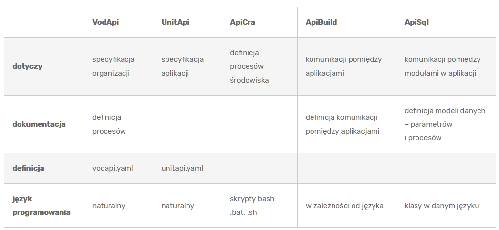

+ [Wersja angielska - EN](https://www.apifoundation.com/)

# Czym jest [API Foundation](https://www.apifoundation.com)?

API Foundation oferuje rozwiązania do budowania aplikacji i usług w dowolnym środowisku.
Podstawowy interfejs API oparty na skryptach powłoki, które  
umożliwiają pobieranie, zarządzanie, przetwarzania i publikowanie danych.

    Standaryzacja -> Modularyzacja -> Automatyzacja

## Dlaczego API Foundation?

API Foundation służy doświadczeniem w zakresie integracji oprogramowania, wspierając powstawanie najlepszych produktów i usług!
Naszym celem jest rozpowszechnianie i wsparcie tych idei i rozwiązań dla każdej otwartej organizacji, społeczności i specjalistów.

## Idea

+ skąd wzięła się idea ekosystemu API Foundation?

Jako programiści, na co dzień używamy wielu zestawów narzędzi.

+ działamy w oparciu o sprawdzone standardy,
+ korzystamy z ekosystemów zapewniających jakość finalnej usługi, aplikacji.

Idea wzięła sie z praktyki, lat doświadczeń i małych ale setek kroków w trakcie tworzenia i korzystania z własnych narzędzi, które  
 obecnie rozwijamy i udostępniamy w ramach organizacji.

Tak w kilka lat powstał gotowy do pokazania ekosystem, który z powodzeniem  może być stosowane przez dowolnej skali firmy i aplikacje.
Kluczowe jest tylko określenie wartości jakich oczekujemy.
+ czy wolimy bardziej kontrolować lokalne środowiska?
+ czy delegować zarządzanie chmurze?

Rozwiązanie API Foundation docenią organizacje ceniące sobie zasoby, gdyż ani techniczne, finansowe czy merytoryczne nie są tutaj przeszkodą nawet
dla jednoosobowej organizacji, wszystkie elementy można wdrożyć w kilka godzin
w ciągu normalnego dnia roboczego online.

### Jak i kiedy zacząć?

Tutaj nie ma ograniczeń, potrzebna jest (wolna) wola i (otwarty) edytor.

Zapewniamy narzędzia do komunikacji oraz darmowe materiały edukacyjne, również na platformie Youtube, za darmo.
Naszym celem jest udostępnienie wielu organizacjom na świecie sprawdzonych praktyk w budowaniu oprogramowania i jego zarządzania.
Chcemy pokazać, że bycie liderem na rynku jest osiągalne bardzo szybko w oparciu o dobre rozwiązania.
Zgodnie z zasadami panującymi w firmie, która jest patronem API Foundation, Softreck - Leadership Through Software Development.

##  Dlaczego warto z pośród tak wielu wybrać rozwiązanie API Foundation?
w zasadzie niczego nie trzeba zmieniać, warto spojrzeć na to rozwiązanie jako na zbiór dobrych praktyk  
 zestawionych w jeden spójny ekosystem i co ważne ze wsparciem merytorycznym samych twórców.

API foundation dedykuje rozwiązania do natywnych środowisk różnych systemów opepracyjnych,
nie chcemy narzucać własnych rozwiązać a pomóc tym, którzy je sobie chcą sami zorganizować
w oparciu o sprawdzony i przetestowany kod.

## Przykładowy scenariusz

Wyobraźmy sobie kolejny dzień pracy, tym razem zaczynamy nowy projekt, nowe środowisko.
Początki bywają trudne, dlatego powoli zagłębiamy się w dokumentację, szukamy rozwiązania na napotkane błędy.

Oczywiście jest masa rozwiązań chmurowych, wirtualizacji, ale w naszym małym projekcie nie mamy tyle czasu,  
dlatego wszystko jest z jednej strony proste ale z drugiej nowe i trzeba samemu sobie poradzić, gdyż nie ma osoby, która wcześniej się tym zajmowała.

Tutaj jest właśnie miejsce na rozwiązanie, jakie na co dzień po części stosujemy, ale nową jakość daje sam ekosystem, który
zdefiniowany przez API Foundation daje przewagę wielu lat doświadczenia.

### Jakie wobec tego mamy rozwiązanie?

Tak jak przy pisaniu oprogramowania - to kod jest dokumentacją, tak samo przy instalowaniu środowiska do uruchomienia kodu,  
to skrypty powłoki shell są dokumentacją wymaganych zależności.

Przykładowo, instalacja odpowiedniej wersji języka PHP wymaga sprawdzenia i decyzji:
+ czy język PHP istnieje w systemie?
+ jeśli tak, to czy obecna wersja jest zgodna z oczekiwaną?

### Co jeśli jedna z powyżsych opcji nie jest prawdziwa?

Skrypt powinien jak najlepiej określić sytuację i zasugerować dalsze rozwiązania, poprzez np.  
 doinstalowanie innego modułu, który rozwiąże brak komponentu, aplikacji, biblioteki.

Często odpowiedzialny jest za to composer, ale nawet jeśli go nie ma, lub jeszcze nie jest zainstalowany to skrypty shell zainicjują go w lokalnym
lub produkcyjnym środowisku.

Język opisowy w rozwiązaniu APICRA jest standardem, daje od razu informację o tym co chcemy osiągnąć.
Każdy skrypt zaczyna się od wyświetlanego przez komendę @echo informacji o przeznaczeniu danego skryptu, np:

    @ECHO OFF
    echo Check if the application works correctly
    WHERE php
    IF %ERRORLEVEL% NEQ 0 (
        echo PHP is NOT installed!
    )

## Korzyści

Istnieją inne dobre rozwiązania i podejścia, API Foundation skupia się na długofalowym wsparciu środowiska tworzenia oprgramowania, rzędu dekad a nie lat.

+ tak jak wiele projektów typu open source, dzielimy się pomysłami i praktyczną wiedzą
+ nasze cele są skupione na osiąganiu lepszego poziomu technicznego a nie zarabianiu
+ to jest powód, dla którego nie zależy nam na monetyzacji, ale na szybkim tworzeniu orpgroamowania i jego praktycznego wykorzystania

## What we offer You?

We Love Software Development and we create the best solutions with pleasure!
We are able to create the best solutions, because we have deep understanding of technology based on advanced projects.
We are earning money on trainings for teams which are opened to increase quality of software deelopment at any time.
We are independent and free to create the best IT solutions on the World!

+ [EDUCATION.md](EDUCATION.md)

### Example of wide spectrum on technical side

if You need solve technical problem based on Python/Java/NodeJS, many solutions are based on one language.
In APIFoundation case we are supporting and proiding for each language the same SDK solution, which aaliable to use in your application programming language.

Who give you the opportunity to use your own technical solutions in external libraries?
We're opened and we're giving You opensource code which is ready to set and go!

---

    No license, no subscriptions, ready to use!

## Jak rozumiemy API (od ang. application programming interface)

to zbiór reguł opisujący to jak programy komunikują się ze sobą

API jest przede wszystkim specyfikacją wytycznych
Implementacja API jest zestawem rutyn, protokołów i rozwiązań informatycznych do budowy aplikacji komputerowych.

Dodatkowo API może korzystać z komponentów graficznego interfejsu użytkownika.

Definiuje się go na poziomie kodu źródłowego dla składników oprogramowania, na przykład aplikacji, bibliotek, systemu operacyjnego.

Zadaniem API, interfejsu programowania aplikacji jest dostarczenie:
  + specyfikacji podprogramów
  + struktur modeli danych
  + definicji klas obiektów
  + oczekiwanych protokołów do komunikacji między aplikacjami

## About API logo

A + (number) PI = API

---

## API Foundation solutions

### [APIbuild](https://www.apibuild.com)

https://github.com/api-build

procesy określające kolejności powstawania nowych wersji oprogramowania, pozwala na odróżnienie wersji między sobą.

Zazwyczaj jest liczbą naturalną (np. numerowanie wersji od 1 lub według roku powstania), liczbą rzeczywistą lub zestawieniem kilku liczb naturalnych. W ostatnim przypadku kolejne liczby oddziela się zazwyczaj kropką, a ich znaczenie jest następujące:
+ Major (numer główny),
+ Minor (numer dodatkowy),
+ Release (numer wydania)

Odpowiedzialna osoba:
+ #MANAGER-ROLE

### [APIunit](https://www.apiunit.com)

https://github.com/apiunit

definition of application for generating project on enironment with source code

Odpowiedzialna osoba:
+ #MANAGER-ROLE
+ #ADMIN-ROLE
+ #DEV-ROLE

### [APIfunc](https://www.apifunc.com)

https://github.com/apifunc

Środowisko do wykonania kodu jednej prostej funkcji dla dowolnego języka programowania z listy:
+ javascript/nodeJS
+ python
+ php

Odpowiedzialna osoba:
+ #DEV-ROLE

### [APIsql](https://www.apisql.com)

https://github.com/apisql

Data integration for models statements

Odpowiedzialna osoba:
+ #DEV-ROLE

### [APIcra](https://www.apicra.com)

https://github.com/apicra

library of shell scripts

Odpowiedzialna osoba:
+ #DEV-ROLE

### [APIexec](https://www.apiexec.com)

https://github.com/apiexec

runner for APIcra scripts

Odpowiedzialna osoba:
+ #DEV-ROLE

---

# The projects are using API Foundation solutions

## [DevOpsTerminal](https://docs.devopsterminal.com/)

https://github.com/DevOpsTerminal

Console Client with WebUI to acces by SSH many servers

Odpowiedzialna osoba:
+ #ADMIN-ROLE

Components:
+ APIexec

## [ProMaGen](https://www.promagen.com/)

https://github.com/promagen

Project Manager & Generator is WebUI client installed on selected server to acces Customers on own projects, by executong defined shell scripts

Odpowiedzialna osoba:
+ #END-USER-ROLE
+ #MANAGER-ROLE

Components:
+ APIexec
+ APIcra

[Narzędzia programisty, software developera - Tom Sapletta 'Blog](https://tom.sapletta.pl/automatyzacja/narzedzia-programisty-software-developera/)

> **VodApi**
>
> **UnitApi**
>
> **ApiCra**
>
> **ApiBuild**
>
> **ApiSql**
>
> **dotyczy**
>
> specyfikacja organizacji
>
> specyfikacja aplikacji
>
> definicja procesów środowiska
>
> komunikacji pomiędzy aplikacjami
>
> komunikacji pomiędzy modułami w aplikacji
>
> **dokumentacja**
>
> definicja procesów
>
> definicja komunikacji pomiędzy aplikacjami
>
> definicja modeli danych – parametrów i procesów
>
> **definicja**
>
> vodapi.yaml
>
> unitapi.yaml
>
> **język programowania**
>
> naturalny
>
> naturalny
>
> skrypty bash: .bat, .sh
>
> w zależności od języka
>
> klasy w danym języku

-   Narzędzia dla programistów:
    -   [https://devtoolsbox.com](https://devtoolsbox.com)
-   **VodApi**
+ Dokumentacja dla firmy
+ Opis każdego **elementu** niezbędnego do działania firmy
+ oraz opis **procesów** koniecznych do uzyskania produktów, usług oferowanych w ramach działalności organizacji
+ Specyfikacja **narzędzi**, ludzi, warunków potrzebnych do uzyskania optymalnych efektów
+ Opis **zasobów**, idei, wykorzystanie do tego **UnitApi**, gdzie każda aplikacja jest opisana
+ np:. Opis sposobów dokumentowania, developmentu, testowania, deploymentu
+ Możliwość tworzenia mierzalnych wyników z analizy okresowej zebranych danych
+ [https://vodapi.com/](https://vodapi.com/)

> -   **UnitApi**
+ Definicja aplikacji oraz procesów koniecznych do jej tworzenia
+ oraz każdego jej elementu, również zewnętrznego (RESTAPI) w języku naturalnym
+ definicja procesów, wykonywanych za pomocą skryptów **ApiCra**
+ create, commit, update, upgrade, test
+ [https://unitapi.com/](https://unitapi.com/)

> -   **ApiCra**
+ implementacja narzędzi i procesów za pomocą skryptów bash’a
+ Ustandaryzowanie bibliotek skryptów oraz używania
+ skrypty usprawniające tworzenie, aktualizację i serwisowanie aplikacji
+ procesy opisane na podstawie definicji **UnitApi**
+ [https://apicra.com/](https://apicra.com/)

> -   **DevopsTerminal**
+ Narzędzie do wizualnego uruchamiania skryptów **ApiCra**, za pomocą przeglądarki internetowej
+ Wykorzystuje specyfikację **UnitApi**
+ [https://devopsterminal.com/](https://devopsterminal.com/)

> -   **ApiBuild**
+ generator kodu API na różne platformy w różnych językach programowania
+ biblioteki wspierające komunikacje na zewnątrz aplikacji
+ generowanie kodu SDK ze specyfikacji **UnitApi** oraz innych specyfikacji jak **swagger,
+ [https://apibuild.com/](https://apibuild.com/)

> -   **ApiSql**
+ Definicja klas Parametrów oraz Procesów w języku programowania aplikacji
+ biblioteki wspierające komunikacje wewnątrz aplikaci, pomiędzy jej modułami
+ modelowanie danych i procesów za wykorzystaniem definicji **UnitApi**
+ np. wymiana danych pomiędzy bazą danych, formularzem, a RESTAPI
+ ustandaryzowanie i przygotowywanie kodu na różne środowiska programowania
+ [https://apisql.com/](https://apisql.com/)

---

# Softreck's API Foundation

The API Foundation is created and sponsored by the Softreck from Estonia.
Softreck Company is sharing tools to give Organisations more benefits, to have under control all steps in software and Hardware Development.
+ [Leadership Through Software Development](https://softreck.com)

## Leadership through software development
At Softreck, we strive to go beyond securing smart technical resources by aiming to become your strategic advisors, providing both thought leadership and best practice to ensure that you are confident in being able to deliver solid results in less time and increase your ROI (Return on Investment).

## Team
That is why our specialised team is built with the right mix of highly skilled architects and consultants, supported by management with years of industry experience.

## Capabilities and requirements of application
The selection and deployment of an initial production API capability is used to prioritise and showcase the baseline platform, whilst delivering a tangible benefit to the business through better alignment and communication of capabilities and requirements.

## Monitoring and report
Another key deliverable is a detailed report and executive presentation that provides Softreck’s assessment for the customer’s desired connectivity/integration platform maturity.

## Our Help

We use technology such as Open API and Deep-Link connections, we can integrate that service into your business platform.

Whether it’s through embedded technology or something as simple as a booking widget, your clients can now access our booking system directly.
We’ll even offer you a return on any reservations made.

Turning a clever feature into a profitable solution.

---

# HOW TO START?
You can exercise all of the Foundation API methods through the API Console as well as view documentation and descriptions of the inputs and outputs of each API method.

## Solutions
We started in 2018 with few concepts but one idea: fastest development.
Now, in 2020 we are giving solutions:

+ [APIexec - executor library for shell scripts](https://www.apiexec.com)
+ [APIcra - shell scripts libraries](https://www.apicra.com)
+ [APIunit - definition of application, CI, CD](https://www.apiunit.com)
+ [APIbuild - build process definition, focused on quality, versioning](https://www.apibuild.com)
+ [APIsql - bazy danych, zapytania, modele](https://www.apisql.com)
+ [APIfunc - rozwiązania dla FaaS](https://www.apifunc.com)

## Our Plans
We are preparing cloud FaaS implementation

### Free Solution

Simple open solution for public FaaS
+ [FaaS.ovh](https://faas.ovh)

### Commercial solution

For private usage, API with authorisation
+ [FaaSapp.com](https://faasapp.com)

## Another solutions
[A Local Dev Tool For Every Project | Lando](https://lando.dev/)
[Tandem](https://github.com/thinktandem)
[Lando](https://github.com/lando)

